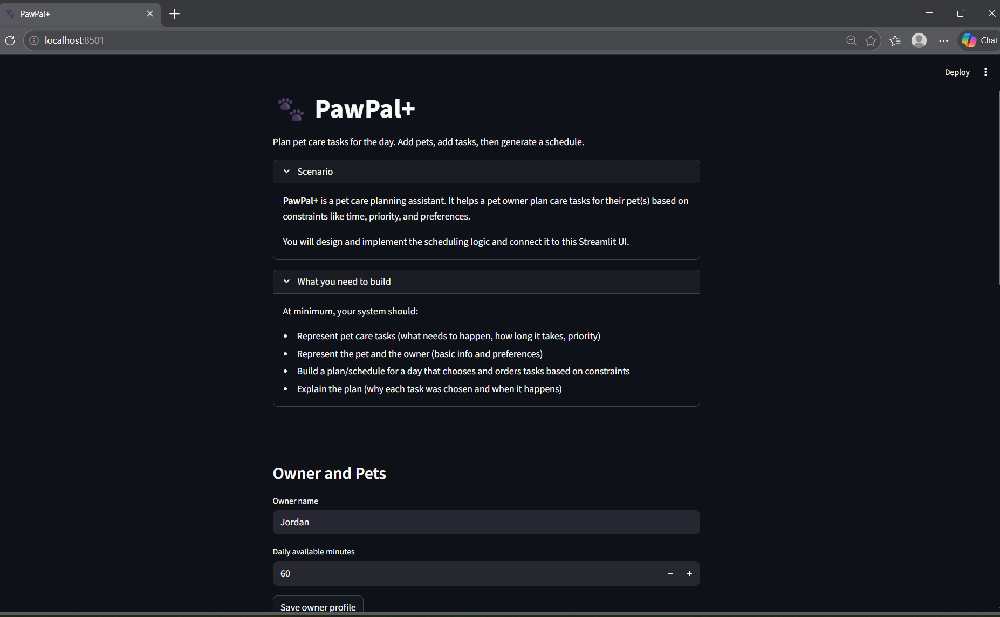

# PawPal+

PawPal+ is a Streamlit app that helps pet owners plan daily care for one or more pets.
It combines task management and scheduling logic to generate a realistic daily plan based on time constraints and task priority.

## Overview

PawPal+ supports:

- Owner profile setup (name and daily available time)
- Multi-pet management
- Task creation with category, duration, priority, time, frequency, and due date
- Daily schedule generation with explanation output

## Features

The app implements the following core algorithms and behaviors:

- Priority scoring for scheduling decisions
- Sorting by time (`HH:MM`) for chronological task views
- Filtering tasks by status (`pending` or `completed`)
- Filtering tasks by selected pet
- Due-date and recurrence checks to collect tasks relevant for the current day
- Conflict warnings when multiple tasks share the same exact start time
- Daily/weekly recurrence rollover when a recurring task is completed
- Time-budget scheduling that plans tasks until available owner minutes are exhausted
- Planned vs deferred task summary generation
- Human-readable explanation log describing why tasks were planned or deferred

## App Workflow

1. Save owner profile and daily available minutes.
2. Add one or more pets.
3. Add tasks to the active pet.
4. Explore tasks using pet/status filters and time sorting.
5. Generate the daily schedule.
6. Review planned tasks, deferred tasks, warnings, and explanation output.

## Project Structure

- `app.py`: Streamlit user interface
- `pawpal_system.py`: Core domain and scheduler logic (`Owner`, `Pet`, `Task`, `Scheduler`)
- `tests/test_pawpal.py`: Automated tests for core scheduling behavior
- `uml_final.png`: Final UML diagram image

## Getting Started

### Requirements

- Python 3.10+

### Setup

```bash
python -m venv .venv
.venv\Scripts\activate
pip install -r requirements.txt
```

### Run the app

```bash
streamlit run app.py
```

### Run tests

```bash
python -m pytest
```

## Testing Coverage

Current tests validate:

- Task completion status updates
- Adding tasks to pets
- Chronological sorting correctness
- Daily recurrence rollover behavior
- Exact-time conflict warning detection

## 📸 Demo

Streamlit app screenshot:

<a href="screenshot_pawpal.png" target="_blank"></a>

## UML Diagram

The final UML reflecting implementation updates is included as `uml_final.png` in the project root.
